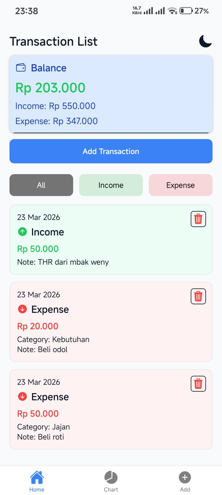
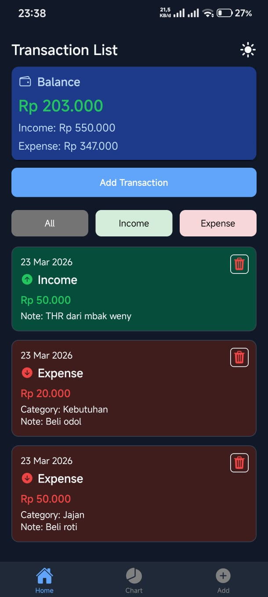
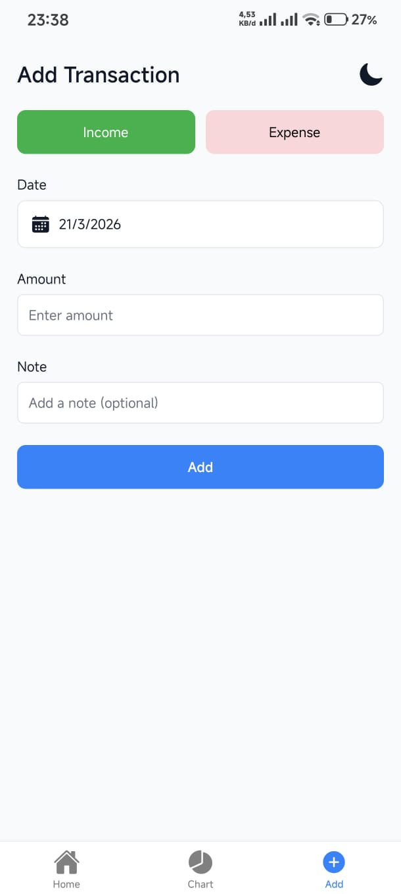
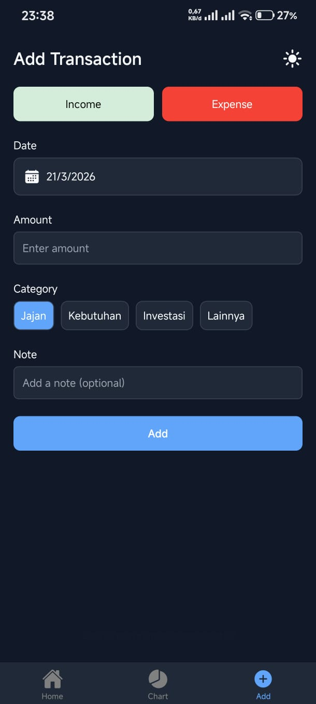
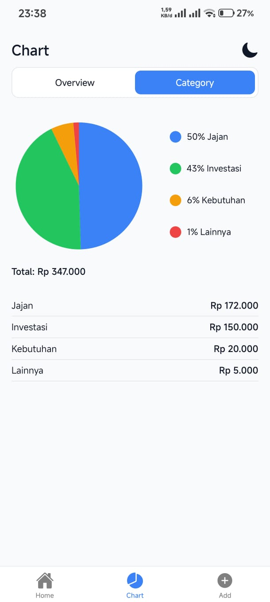
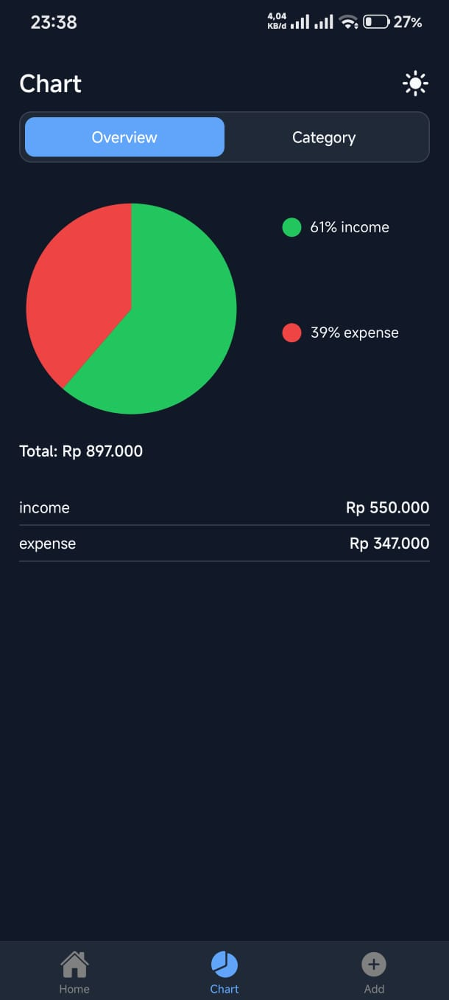

# THR Manager App - THR Minggu 4 State Management

## Informasi Mahasiswa

- Nama : Muhammad Prayogo Pangestu
- NIM : 2410501046
- Opsi : B - THR Manager APP

## Deskripsi Aplikasi

Aplikasi THR Manager App adalah aplikasi mobile sederhana berbasis React Native untuk mencatat pemasukan dan pengeluaran selama Hari Raya. Pengguna bisa menambahkan transaksi, memilih kategori pengeluaran, serta melihat daftar transaksi yang sudah dicatat.

Aplikasi ini juga menampilkan ringkasan keuangan seperti total saldo, pemasukan, dan pengeluaran, serta dilengkapi dengan chart untuk membantu memahami kondisi keuangan. Data disimpan menggunakan AsyncStorage sehingga tetap tersimpan meskipun aplikasi ditutup.

## Hooks yang Digunakan

- useState:
  Digunakan untuk mengelola state lokal pada beberapa komponen, seperti:
  1. Input form (amount, note, category, date) pada AddTransactionScreen
  2. Filter transaksi (all / income / expense) pada HomeScreen
  3. Mode tampilan chart (overview / category) pada ChartScreen
  4. State fokus input untuk formatting currency

- useEffect:
  Digunakan pada WalletContext untuk:
  - Load data dari AsyncStorage saat pertama kali applikasi dibuka/jalankan
  - Menyimpan data transaksi ke AsyncStorage setiap kali state berubah

- useReducer:
  Digunakan di dalam WalletContext untuk mengelola state global transaksi
  Action types yang digunakan:
  1. ADD_INCOME untuk menambahkan data pemasukan
  2. ADD_EXPENSE untuk menambahkan data pengeluaran
  3. DELETE_TRANSACTION untuk menghapus transaksi berdasarkan ID
  4. SET_TRANSACTIONS untuk memuat data dari AsyncStorage

- Custom Hook:
  UseWallet
  Digunakan untuk:
  - Menghitung total saldo (balance)
  - Menghitung total pemasukan (income)
  - Menghitung total pengeluaran (expense)

## Screenshot

Berikut tampilan aplikasi:

### Home Screen Light & Dark mode

### Add Transaction Light & Dark mode

### Chart Screen Light & Dark mode

## Cara Menjalankan

npm install && npx expo start
